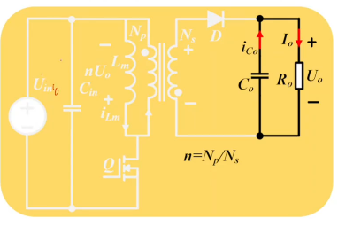
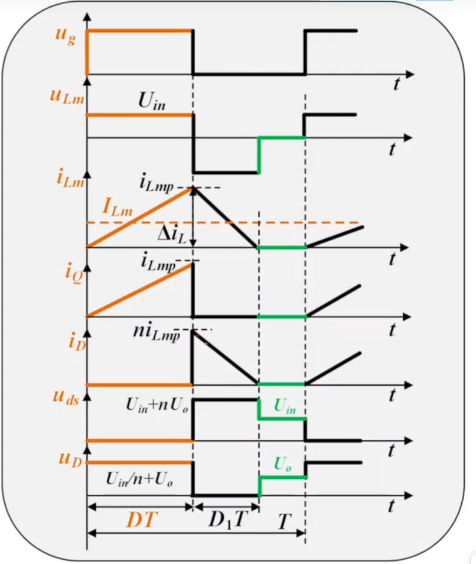
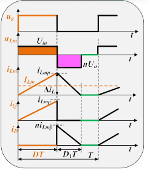

# 第七章 反激变换器 第三节：反激DCM工作过程与增益

[上一节](7.2-等效变换与BCM工作过程.md)给出了 BCM 的临界条件。越过临界点（继续增大 $R_o$ ，或继续减小 $L_m$ ），变换器进入 **DCM（断续导通模式）**。本节讨论：**DCM 的三个模态是什么？DCM 增益怎么推导、为什么与匝比 $n$ 无关？ $D$ 的上限被什么卡住？如何证明 DCM 增益大于 CCM？**

---

## 一、DCM工作过程

DCM 比 CCM/BCM **多了一个模态**：

| 模态 | 时段 | 原边 | 副边 | 负载供电 |
|---|---|---|---|---|
| **模态一** | $DT$ | Q 导通， $i_{Lm}$ 从**零**升到 $i_{Lmp}$ | 二极管截止，无电流 | 输出电容 $C_o$ |
| **模态二** | $D_1T$ | Q 截止，电流移到副边 | 二极管导通， $i_D=n\cdot i_{Lmp}$ ，线性下降 | 副边 + $C_o$ |
| **模态三** | 剩余时间 | Q 截止 | **二极管电流已降到零，自然关断** | **仅靠 $C_o$** |

> **模态三是 DCM 独有的空档期**——原副边都没有电流，负载功率完全由 $C_o$ 提供（所以 DCM 的输出纹波会大一些）。此时变压器能量已**完全释放完毕**（ $i=0$ ，储能 $\frac{1}{2}Li^2=0$ ）。

**关于模态二的两个要点**

- 原边电流"转移"到副边，副边电流峰值为 $n\cdot i_{Lmp}$——这由**安（匝）秒平衡**决定，本质仍是**磁通守恒**
- 副边承受的是反向电压（上正下负），电流从峰值线性下降

---

## 二、DCM增益

用伏秒平衡，把副边电压折算到原边（与[7.1 节](7.1-反激CCM工作过程.md)同理）：

$$U_{in}\cdot DT = n\cdot U_o\cdot D_1T \quad\Rightarrow\quad \frac{U_o}{U_{in}}=\frac{1}{n}\cdot\frac{D}{D_1} \quad \text{(7.3-1)}$$

其中 $D_1$ 是**二极管导通占空比**（未知量）。再由"**二极管平均电流 = 负载电流**"：

$$I_{D\_avg}=\frac{\frac{1}{2}\cdot D_1T\cdot n\cdot i_{Lmp}}{T}=\frac{1}{2}D_1\,n\,i_{Lmp}=I_o=\frac{U_o}{R_o} \quad \text{(7.3-2)}$$

而原边峰值电流用导通阶段求：

$$i_{Lmp}=\frac{U_{in}}{L_P}\cdot DT \quad \text{(7.3-3)}$$

三式联立（解一个一元二次方程），得到反激的 DCM 增益：

$$\boxed{M=\frac{U_o}{U_{in}}=D\sqrt{\frac{R_oT}{2L_P}}} \quad \text{(7.3-4)}$$

### 2.1 两个重要结论

> **① 反激的 DCM 增益与 Buck-Boost 的 DCM 增益完全一样**（ $M=D\sqrt{R_oT/(2L_P)}$ ）——这再次印证了"反激 = 隔离版 Buck-Boost"。
>
> **② 反激的 DCM 增益与匝比 $n$ 无关！**（式(7.3-4) 中根本没有 $n$ ）

**为什么与匝比无关？** 因为增益只与 $D$ 、 $R_o$ 、 $T$ 、 $L_P$ 有关——在 DCM 下电感能量每个周期**全部释放**，输出功率只取决于"存了多少能量、放了多少次"，与两个绕组怎么分配电压无关。

### 2.2 $D_1$ 的表达式

把 $M$ 带回式(7.3-1)：

$$\boxed{D_1=\frac{1}{n}\sqrt{\frac{2L_P}{R_oT}}=\sqrt{\frac{2L_S}{R_oT}}} \quad \text{(7.3-5)}$$

> 用副边电感 $L_S=L_P/n^2$ 表示时， $D_1$ 的形式与 Buck-Boost 完全一致——说明它落在副边侧考虑更自然。

---

## 三、窗口约束： $D+D_1\le1$

DCM 的一个基本事实是**三个模态的时间加起来不能超过一个周期**：

$$D+D_1\le1 \quad \text{(7.3-6)}$$

把伏秒平衡式(7.3-1)给出的 $D_1=\dfrac{D\cdot U_{in}}{nU_o}$ 代入：

$$D\left(1+\frac{U_{in}}{nU_o}\right)\le1 \quad\Rightarrow\quad \boxed{D\le\frac{nU_o}{U_{in}+nU_o}=\frac{U_{or}}{U_{in}+U_{or}}} \quad \text{(7.3-7)}$$

> **一个漂亮的桥梁结论：DCM 的 $D$ 上限恰好等于 CCM 的 $D$ 表达式！**
>
> - 取**等号**时 $D+D_1=1$ → 空档期 $T_D=0$ → 正是 **BCM**
> - 取**小于号** → DCM， $D$ 越小空档期越长
> - **不可能取大于号**——若 $D$ 超过 $\dfrac{U_{or}}{U_{in}+U_{or}}$ ，方程无解，变换器只能转入 CCM
>
> 这就是 DCM 与 CCM 在 $D$ 轴上的**边界**：DCM 工作于 BCM 边界以下，CCM 工作于边界以上（CCM 的 $D$ 不再由窗口约束决定，而由闭环稳态决定）。

**工程意义：**

- 最低输入电压处 $D_{max}$ 最大，窗口**最紧**——DCM 设计必须校验 $D_{max}+D_{1\_max}\le1$ （通常留 5~10% 余量给开关暂态）
- 这也解释了 [7](7.14-设计实例.md) 中 $D_{max}$ 取 0.45、 $D_{max}+D_1=0.93<1$ 的依据

---

## 四、DCM增益 > CCM增益（严格证明）

### 4.1 结论

> 在**相同占空比 $D$** 下，反激 DCM 模式的增益**大于** CCM 模式的增益：

$$\left.\frac{U_o}{U_{in}}\right|_{DCM} > \left.\frac{U_o}{U_{in}}\right|_{CCM} = \frac{D}{n(1-D)}$$

### 4.2 证明

进入 DCM 的前提是 $L_m<L_{m\_crit}$ 。代入 [式(7.2-4)](7.2-等效变换与BCM工作过程.md) $L_{m\_crit}=\dfrac{n^2R_o(1-D)^2T}{2}$ ：

$$L_m < L_{m\_crit} \;\Rightarrow\; \frac{R_oT}{2L_m} > \frac{R_oT}{2L_{m\_crit}} = \frac{1}{n^2(1-D)^2}$$

（ $L_m$ 在**分母**上， $L_m$ 越小则该比值越大；这里用 $L_{m\_crit}$ 代入得到的是它的**下限**。）

两边开方后代入式(7.3-4)：

$$M = D\sqrt{\frac{R_oT}{2L_m}} > D\cdot\frac{1}{n(1-D)} = \frac{D}{n(1-D)}$$

证毕。

> **四个拓扑的结论一致：相同 $D$ 下，DCM 增益恒大于 CCM 增益**（[Buck](../../01.Buck/3.3-DCM增益分析.md)、[Boost](../../02.Boost/4.9-DCM增益分析.md)、[Buck-Boost](../../03.Buck-Boost/5.8-DCM增益分析.md)、反激均已证明）。
>
> **初学者常见误区：** 凭直觉认为 DCM 增益小于 CCM，这是**反的**。

---

## 五、本节小结

| 主题 | 核心结论 |
|---|---|
| DCM 三模态 | ①Q导通储能（副边无流）②副边二极管导通释能 ③**原副边均无电流的空档期** |
| 匝比关系 | 副边电流峰值 $=n\cdot i_{Lmp}$ （安秒平衡/磁通守恒） |
| DCM 增益 | $M=D\sqrt{\dfrac{R_oT}{2L_P}}$ ，**与 Buck-Boost 相同、与匝比 $n$ 无关** |
| $D_1$ | $D_1=\dfrac{1}{n}\sqrt{\dfrac{2L_P}{R_oT}}=\dfrac{D\cdot U_{in}}{nU_o}$ |
| 窗口约束 | $D+D_1\le1\ \Rightarrow\ D\le\dfrac{U_{or}}{U_{in}+U_{or}}$——**上限恰好是 CCM 的 $D$ 表达式**，等号即 BCM |
| DCM vs CCM | 相同 $D$ 下 DCM 增益 **>** CCM 增益（已证明） |

---

## 六、与后续内容的衔接

- [下一节](7.4-反激励磁电感计算.md)：用本节得到的 $M$ 、 $i_{Lmp}$ 、 $D_1$ 计算 CCM / DCM 两种模式下的**励磁电感 $L_m$**。
- 漏感与 RCD 钳位问题见 [第五节](7.5-反激变压器漏感影响.md) 起。
