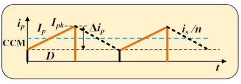
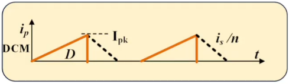

# 第七章 反激变换器 第三节：反激励磁电感计算

[上一节](7.2-反激等效变换.md)把反激等效成了 Buck-Boost，并给出了 BCM 的临界条件。本节继续往前走：**DCM 的工作过程与增益怎么算？CCM 和 DCM 两种模式下励磁电感 $L_m$ 分别怎么设计？为什么反激的 DCM 增益与匝比 $n$ 无关？**

---

## 一、DCM工作过程

从 BCM 继续往前走（继续增大 $R_o$ ，或继续减小 $L_m$ ），变换器进入 **DCM**——比 CCM/BCM **多了一个模态**：

| 模态 | 时段 | 原边 | 副边 | 负载供电 |
|---|---|---|---|---|
| **模态一** | $DT$ | Q 导通， $i_{Lm}$ 从**零**升到 $i_{Lmp}$ | 二极管截止，无电流 | 输出电容 $C_o$ |
| **模态二** | $D_1T$ | Q 截止，电流移到副边 | 二极管导通， $i_D=n\cdot i_{Lmp}$ ，线性下降 | 副边 + $C_o$ |
| **模态三** | 剩余时间 | Q 截止 | **二极管电流已降到零，自然关断** | **仅靠 $C_o$** |

> **模态三是 DCM 独有的空档期**——原副边都没有电流，负载功率完全由 $C_o$ 提供（所以 DCM 的输出纹波会大一些）。此时变压器能量已**完全释放完毕**（ $i=0$ ，储能 $\frac{1}{2}Li^2=0$ ）。

**关于模态二的两个要点**

- 原边电流"转移"到副边，副边电流峰值为 $n\cdot i_{Lmp}$——这由**安（匝）秒平衡**决定，本质仍是**磁通守恒**
- 副边承受的是反向电压（上正下负），电流从峰值线性下降

---

## 二、DCM增益

用伏秒平衡，把副边电压折算到原边（与[7.1 节](7.1-反激CCM工作过程.md)同理）：

$$U_{in}\cdot DT = n\cdot U_o\cdot D_1T \quad\Rightarrow\quad \frac{U_o}{U_{in}}=\frac{1}{n}\cdot\frac{D}{D_1} \quad \text{(7.3-1)}$$

其中 $D_1$ 是**二极管导通占空比**（未知量）。再由"**二极管平均电流 = 负载电流**"：

$$I_{D\_avg}=\frac{\frac{1}{2}\cdot D_1T\cdot n\cdot i_{Lmp}}{T}=\frac{1}{2}D_1\,n\,i_{Lmp}=I_o=\frac{U_o}{R_o} \quad \text{(7.3-2)}$$

而原边峰值电流用导通阶段求：

$$i_{Lmp}=\frac{U_{in}}{L_P}\cdot DT \quad \text{(7.3-3)}$$

三式联立（解一个一元二次方程），得到反激的 DCM 增益：

$$\boxed{M=\frac{U_o}{U_{in}}=D\sqrt{\frac{R_oT}{2L_P}}} \quad \text{(7.3-4)}$$

### 2.1 两个重要结论

> **① 反激的 DCM 增益与 Buck-Boost 的 DCM 增益完全一样**（ $M=D\sqrt{R_oT/(2L_P)}$ ）——这再次印证了"反激 = 隔离版 Buck-Boost"。
>
> **② 反激的 DCM 增益与匝比 $n$ 无关！**（式(7.3-4) 中根本没有 $n$ ）

**为什么与匝比无关？** 因为增益只与 $D$ 、 $R_o$ 、 $T$ 、 $L_P$ 有关——在 DCM 下电感能量每个周期**全部释放**，输出功率只取决于"存了多少能量、放了多少次"，与两个绕组怎么分配电压无关。

### 2.2 $D_1$ 的表达式

把 $M$ 带回式(7.3-1)：

$$\boxed{D_1=\frac{1}{n}\sqrt{\frac{2L_P}{R_oT}}=\sqrt{\frac{2L_S}{R_oT}}} \quad \text{(7.3-5)}$$

> 用副边电感 $L_S=L_P/n^2$ 表示时， $D_1$ 的形式与 Buck-Boost 完全一致——说明它落在副边侧考虑更自然。

---

## 三、励磁电感计算

### 3.1 CCM模式下的励磁电感

设原边（励磁）电流平均值为 $I_P$ 、纹波为 $\Delta I_P$ 。

**① 平均值关系：** 把副边电流折算到原边，负载电流变成 $I_o/n$ ；再套用 Buck-Boost 的 $I_L=\dfrac{I_o}{1-D}$ ：

$$I_P=\frac{I_o/n}{1-D}=\frac{I_o}{n(1-D)} \quad \text{(7.3-6)}$$

**② 纹波：** 由导通阶段

$$\Delta I_P=\frac{U_{in}\cdot DT}{L_P}=\frac{U_{in}D}{f\,L_P} \quad \text{(7.3-7)}$$

**③ 引入电流纹波率 $\tau$**（定义在**原边**： $\tau=\Delta I_P/I_P$ ，其中电流都已折算到原边）：

$$\Delta I_P=\tau\cdot I_P=\frac{\tau I_o}{n(1-D)}$$

比较 ②③ 两式并解出 $L_P$ ：

$$L_P=\frac{U_{in}D}{\Delta I_P\cdot f}=\frac{n\,U_{in}D(1-D)}{\tau\,f\,I_o}$$

再利用增益公式 $U_o/U_{in}=\dfrac{1}{n}\cdot\dfrac{D}{1-D}$ （即 $nU_o(1-D)=U_{in}D$ ）消去 $\dfrac{n(1-D)}{U_{in}}$ 相关的量，并代入 $I_o=P_o/U_o$ ，最终化为一个极简的形式：

$$\boxed{L_P=\frac{\eta\cdot U_{in}^2\cdot D^2}{\tau\cdot f\cdot P_o}} \quad \text{(7.3-8)}$$

> **注意分子上的 $U_{in}^2D^2$**：由于 $nU_o(1-D)=U_{in}D$ ，两个"$U_{in}D$"相乘就出现了平方项——这正是式(7.3-8) 如此简洁的原因。

**设计点：** 与 Buck-Boost 一样，反激在**最低输入电压**下设计（此时**占空比最大** $D_{max}$ ，励磁电流峰值最大、储能最大、最容易饱和）。所以上式中的 $U_{in}$ 取 $U_{in\_min}$ 、 $D$ 取 $D_{max}$ 。

### 3.2 关于效率 $\eta$ 的两种理解

$P_o$ 是输出功率，式(7.3-8) 中出现了效率 $\eta$ 。**$\eta$ 有多种理解方式**：

| 理解方式 | 假设 | 含义 |
|---|---|---|
| **方式一** | $I_o$ 不变，损耗全部体现在**输出电压**上 | 实际输出电压降为 $\eta\cdot U_o$ |
| **方式二** | $U_o$ 不变，损耗全部体现在**输出电流**上 | 实际输出电流降为 $\eta\cdot I_o$ （ $\eta U_oI_o=U_o\cdot\eta I_o$ ） |

> 方式二更直观：输入这么多功率 $P_0$ ，由于效率不是 100%，输出端只能送出 $\eta P_0$——拉不出那么多功率，电流上不去了。
>
> $\eta$ 的深入理解（不只这一个式子、多种理解方式）后续会专门讨论。

### 3.3 电流纹波率 $\tau$ 的取值范围

$$\tau=0.4\sim1.4 \quad(\text{或到 }1.2)$$

> 反激可以取比较大的 $\tau$——**与 Buck-Boost 一样大**，而**不像 Buck、Boost 那样只有 0.4 左右**。原因见 [Buck-Boost 第五节](../../03.Buck-Boost/5.3-CCM电感设计.md)：反激的电感（变压器）不与任何电容长期相连，且要储存全部输出功率能量。

### 3.4 DCM模式下的励磁电感

DCM 下计算更简单——因为每个周期能量**全部释放**：

$$P_o=\eta\cdot\frac{1}{2}L_P\,i_{pk}^2\cdot f$$

其中峰值 $i_{pk}=\dfrac{U_{in}DT}{L_P}$ （同样在最低输入电压下计算）。代入整理：

$$\boxed{L_P=\frac{\eta\cdot U_{in}^2\cdot D^2}{2\cdot f\cdot P_o}} \quad \text{(7.3-9)}$$

> **与 CCM 式(7.3-8) 对比：分子完全相同，分母只是把 $\tau$ 换成了 2**——因为 $\tau=2$ 正是 BCM 的临界条件，两式在此处自然衔接 ✓。
>
> 如果不用 $\tau$ 而直接用**峰值电流**来写 DCM 的设计式，会更直观（DCM 下峰值就是全部信息）。

---

## 四、DCM与CCM的对比

### 4.1 全程 DCM 的条件

$$L_m < L_{m\_crit}\text{ 的最小值}$$

由 $L_{m\_crit}=\dfrac{n^2R_o(1-D)^2T}{2}$ 可知， $D$ 最大时该值最小——也就是**最低输入电压**处。若设计的励磁电感小于这个最小值，则变换器**全程工作于 DCM**。

### 4.2 优缺点对比

| 项目 | DCM | CCM |
|---|---|---|
| 原边电流峰值（同条件） | **更高** | 较低 |
| 二极管反向恢复 | **无**（自然到零关断） | 有 |
| 开关管开通损耗 | **小**（零电流开通） | 大 |
| 稳定性 | **更容易稳定** | 不易稳定，可能震荡 |

> **DCM 更容易稳定的原因：** DCM 下系统的**右半平面零点被推到很高的频率**上，对中低频段的相位影响很小 → **相位裕度升高** → 稳定性更好。
>
> CCM 相反——右半平面零点频率较低，容易引起震荡，工程上常采用**峰值电流控制**等手段改善（详见系统建模与环路设计部分）。

> **有意思的对比：** 在 Buck 中，CCM 与 DCM 的取舍主要看峰值电流与纹波；而**在反激中，DCM 反而在稳定性和开关损耗上占优**——这也是小功率反激大量工作在 DCM 的原因之一。

---

## 五、本节小结

| 主题 | 核心结论 |
|---|---|
| DCM 三模态 | ①Q导通储能（副边无流）②副边二极管导通释能 ③**原副边均无电流的空档期** |
| 匝比关系 | 副边电流峰值 $=n\cdot i_{Lmp}$ （安秒平衡/磁通守恒） |
| DCM 增益 | $M=D\sqrt{\dfrac{R_oT}{2L_P}}$ ，**与 Buck-Boost 相同、与匝比 $n$ 无关** |
| $D_1$ | $D_1=\dfrac{1}{n}\sqrt{\dfrac{2L_P}{R_oT}}$ |
| CCM 励磁电感 | $L_P=\dfrac{\eta U_{in}^2D^2}{\tau fP_o}$ ， $\tau$ 取 0.4~1.4 |
| DCM 励磁电感 | $L_P=\dfrac{\eta U_{in}^2D^2}{2fP_o}$ （把 $\tau$ 换成 2） |
| 设计点 | 最低输入电压（ $D_{max}$ ），励磁峰值电流最大、最易饱和 |
| 效率 $\eta$ | 两种理解：损耗落在输出电压上，或落在输出电流上 |
| DCM 优势 | 无反向恢复、零电流开通、**稳定性更好**（右半平面零点被推高） |

---

## 六、与后续内容的衔接

- 励磁电感确定后，反激的**主要参数**就基本齐了。但反激还有两个绕不开的问题：**漏感**与**RCD 钳位**。
- [下一节](7.4-反激变压器漏感影响.md)：漏感的来源、对开关管的致命影响（电压尖峰），以及 RCD 吸收回路的引入。
