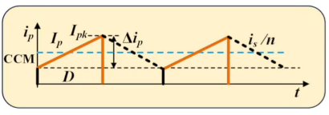
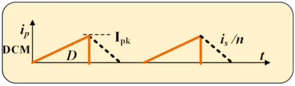

# 第七章 反激变换器 第四节：反激励磁电感计算

[上一节](7.3-反激DCM工作过程与增益.md)得到了 DCM 增益与窗口约束。本节解决**励磁电感 $L_m$ 的取值**：**CCM 和 DCM 两种模式下 $L_m$ 分别怎么算？效率 $\eta$ 怎么理解？ $\tau$ 取多大？为什么反激变压器必须开气隙？** 最后给出设计流程与模式选择分界。

---

## 一、CCM模式下的励磁电感

设原边（励磁）电流平均值为 $I_P$ 、纹波为 $\Delta I_P$ 。

**① 平均值关系：** 把副边电流折算到原边，负载电流变成 $I_o/n$ ；再套用 Buck-Boost 的 $I_L=\dfrac{I_o}{1-D}$ ：

$$I_P=\frac{I_o/n}{1-D}=\frac{I_o}{n(1-D)} \quad \text{(7.4-1)}$$

**② 纹波：** 由导通阶段

$$\Delta I_P=\frac{U_{in}\cdot DT}{L_P}=\frac{U_{in}D}{f\,L_P} \quad \text{(7.4-2)}$$

**③ 引入电流纹波率 $\tau$**（定义在**原边**： $\tau=\Delta I_P/I_P$ ，其中电流都已折算到原边）：

$$\Delta I_P=\tau\cdot I_P=\frac{\tau I_o}{n(1-D)}$$

比较 ②③ 两式并解出 $L_P$ ：

$$L_P=\frac{U_{in}D}{\Delta I_P\cdot f}=\frac{n\,U_{in}D(1-D)}{\tau\,f\,I_o}$$

再利用增益公式 $U_o/U_{in}=\dfrac{1}{n}\cdot\dfrac{D}{1-D}$ （即 $nU_o(1-D)=U_{in}D$ ）消去 $\dfrac{n(1-D)}{U_{in}}$ 相关的量，并代入 $I_o=P_o/U_o$ ，最终化为一个极简的形式：

$$\boxed{L_P=\frac{\eta\cdot U_{in}^2\cdot D^2}{\tau\cdot f\cdot P_o}} \quad \text{(7.4-3)}$$

> **注意分子上的 $U_{in}^2D^2$**：由于 $nU_o(1-D)=U_{in}D$ ，两个"$U_{in}D$"相乘就出现了平方项——这正是式(7.4-3) 如此简洁的原因。

**设计点：** 与 Buck-Boost 一样，反激在**最低输入电压**下设计（此时**占空比最大** $D_{max}$ ，励磁电流峰值最大、储能最大、最容易饱和）。所以上式中的 $U_{in}$ 取 $U_{in\_min}$ 、 $D$ 取 $D_{max}$ 。

---

## 二、关于效率 $\eta$ 的两种理解

$P_o$ 是输出功率，式(7.4-3) 中出现了效率 $\eta$ 。**$\eta$ 有多种理解方式**：

| 理解方式 | 假设 | 含义 |
|---|---|---|
| **方式一** | $I_o$ 不变，损耗全部体现在**输出电压**上 | 实际输出电压降为 $\eta\cdot U_o$ |
| **方式二** | $U_o$ 不变，损耗全部体现在**输出电流**上 | 实际输出电流降为 $\eta\cdot I_o$ （ $\eta U_oI_o=U_o\cdot\eta I_o$ ） |

> 方式二更直观：输入这么多功率 $P_0$ ，由于效率不是 100%，输出端只能送出 $\eta P_0$——拉不出那么多功率，电流上不去了。
>
> $\eta$ 的深入理解（不只这一个式子、多种理解方式）后续会专门讨论。

---

## 三、电流纹波率 $\tau$ 的取值范围

$$\tau=0.4\sim1.4 \quad(\text{或到 }1.2)$$

> 反激可以取比较大的 $\tau$——**与 Buck-Boost 一样大**，而**不像 Buck、Boost 那样只有 0.4 左右**。原因见 [Buck-Boost 第五节](../../03.Buck-Boost/5.3-CCM电感设计.md)：反激的电感（变压器）不与任何电容长期相连，且要储存全部输出功率能量。

---

## 四、DCM模式下的励磁电感

DCM 下计算更简单——因为每个周期能量**全部释放**：

$$P_o=\eta\cdot\frac{1}{2}L_P\,i_{pk}^2\cdot f$$

其中峰值 $i_{pk}=\dfrac{U_{in}DT}{L_P}$ （同样在最低输入电压下计算）。代入整理：

$$\boxed{L_P=\frac{\eta\cdot U_{in}^2\cdot D^2}{2\cdot f\cdot P_o}} \quad \text{(7.4-4)}$$

> **与 CCM 式(7.4-3) 对比：分子完全相同，分母只是把 $\tau$ 换成了 2**——因为 $\tau=2$ 正是 BCM 的临界条件，两式在此处自然衔接 ✓。
>
> 如果不用 $\tau$ 而直接用**峰值电流**来写 DCM 的设计式，会更直观（DCM 下峰值就是全部信息）： $L_m=\dfrac{U_{in\_min}D_{max}}{f\cdot i_{Lmp}}$ ，其中 $i_{Lmp}=\dfrac{2P_o}{\eta U_{in\_min}D_{max}}$ 。

---

## 五、为什么反激变压器必须开气隙

这是反激 $L_m$ 设计**最常被问的工程问题**。答案一句话：

$$\boxed{\text{反激变压器是"储能元件"，不是"传能元件"——能量必须存得下，而磁芯本身存不下多少能量}}$$

**定量理解：**

磁场的能量密度为 $\dfrac{1}{2}B\cdot H=\dfrac{B^2}{2\mu}$ 。铁氧体磁芯的磁导率 $\mu_r$ 高达几千——同样的 $B$ 下其 $H=B/\mu$ 极小，所以**磁芯里几乎存不下能量**：

$$E_{max}=\frac{B_{sat}^2}{2\mu}\cdot V_e \quad\text{极小} \quad \text{(7.4-5)}$$

而气隙的 $\mu=\mu_0$ ， $H$ 巨大，能量密度高 $\mu_r$ 倍。开气隙后，**绝大部分能量储存在气隙里**，磁芯只负责"引导磁路"：

$$E\approx\frac{B^2}{2\mu_0}\cdot A_e\cdot l_g \quad \text{(7.4-6)}$$

> **不开气隙的后果：** 励磁电流稍一增大，磁芯就进入**饱和**（ $B\to B_{sat}$ ）→ 电感量骤降 → 电流尖峰失控 → 器件损坏。
>
> **气隙长度怎么算：** $l_g\approx\dfrac{\mu_0N_P^2A_e}{L_m}$——完整的磁路计算（含边缘磁通修正）见**第六章 磁元件设计**。

> **一句话记住：** 传统变压器"传能"（原副边同时有电流，磁芯不储能）；反激变压器"储能"（先存后放），气隙就是它的"储能罐"。这是反激与正激变压器绕制上最大的区别。

---

## 六、 $L_m$ 设计五步流程

| 步骤 | 内容 | 用到的式 |
|---|---|---|
| **1** | 定 $D_{max}$ （取 0.45~0.5，同时受窗口约束） | [式(7.3-7)](7.3-反激DCM工作过程与增益.md) |
| **2** | 算峰值电流：DCM 用 $i_{Lmp}=\dfrac{2P_o}{\eta U_{in\_min}D_{max}}$ ；CCM 用 $I_P(1+\tau/2)$ | 能量平衡 / 式(7.4-1) |
| **3** | 算 $L_m$ ：CCM 用式(7.4-3)、DCM 用式(7.4-4)（都在最低输入电压、满载下） | 式(7.4-3)/(7.4-4) |
| **4** | **校验模式**：DCM 要求 $i_{Lmp}>2I_P$ （即 $\tau>2$ ）或 $L_m<$ 临界值最小值；CCM 要求 $\tau<2$ | [式(7.2-4)](7.2-反激等效变换.md) |
| **5** | **校验窗口**： $D_{max}+D_{1\_max}\le0.9\sim0.95$ （留开关暂态余量） | 式(7.3-6) |

> 完整数值走查见 [7](7.14-设计实例.md)（60W，DCM： $D_{max}=0.45$ 、 $i_{Lmp}=3.29A$ 、 $L_m=190\mu H$ 、 $D+D_1=0.93$ ）。

---

## 七、DCM与CCM的对比

### 7.1 全程 DCM 的条件

$$L_m < L_{m\_crit}\text{ 的最小值}$$

由 $L_{m\_crit}=\dfrac{n^2R_o(1-D)^2T}{2}$ 可知， $D$ 最大时该值最小——也就是**最低输入电压**处。若设计的励磁电感小于这个最小值，则变换器**全程工作于 DCM**。

### 7.2 优缺点对比

| 项目 | DCM | CCM |
|---|---|---|
| 原边电流峰值（同条件） | **更高** | 较低 |
| 二极管反向恢复 | **无**（自然到零关断） | 有 |
| 开关管开通损耗 | **小**（零电流开通） | 大 |
| 稳定性 | **更容易稳定** | 不易稳定，可能震荡 |

> **DCM 更容易稳定的原因：** DCM 下系统的**右半平面零点被推到很高的频率**上，对中低频段的相位影响很小 → **相位裕度升高** → 稳定性更好（机理见 [7](7.12-右半平面零点与稳定性.md)）。
>
> CCM 相反——右半平面零点频率较低，容易引起震荡，工程上常采用**峰值电流控制**等手段改善（详见系统建模与环路设计部分）。

### 7.3 模式选择的功率分界

| 功率 | 推荐模式 | 理由链 |
|---|---|---|
| **<100W**（充电器、辅源） | **DCM / QR** | 峰值电流绝对值小、代价可接受；换来环路好设计（无 RHP 约束）、无反向恢复、 $L_m$ 小体积小 |
| **>100W** | **CCM**（需斜坡补偿） | 峰值电流低 30~40%（管子应力小、损耗低）、变压器利用率高；代价是 RHP 零点压低带宽 + 斜坡补偿 |

> **为什么峰值电流差这么多？** DCM 的三角波要从零升起、面积又必须等于平均值 → 峰值必大；CCM 的梯形波"起点已抬高"，同样面积下峰值更低（数值对照见 [7.14 节](7.14-设计实例.md)：3.29A vs 1.93A）。

---

## 八、本节小结

| 主题 | 核心结论 |
|---|---|
| CCM 励磁电感 | $L_P=\dfrac{\eta U_{in}^2D^2}{\tau fP_o}$ ， $\tau$ 取 0.4~1.4 |
| DCM 励磁电感 | $L_P=\dfrac{\eta U_{in}^2D^2}{2fP_o}$ （把 $\tau$ 换成 2，两式在 BCM 处衔接） |
| 设计点 | 最低输入电压（ $D_{max}$ ），励磁峰值电流最大、最易饱和 |
| 效率 $\eta$ | 两种理解：损耗落在输出电压上，或落在输出电流上 |
| 开气隙 | 反激变压器是**储能元件**，能量存在气隙（ $E\approx\frac{B^2}{2\mu_0}A_el_g$ ）；不开气隙必饱和 |
| 设计流程 | 定 $D_{max}$ → 算峰值 → 算 $L_m$ → 校验模式 → 校验窗口 |
| 模式分界 | <100W 选 DCM/QR；>100W 选 CCM（+斜坡补偿） |

---

## 九、与后续内容的衔接

- [下一节](7.5-反激变压器漏感影响.md)：漏感的来源、对开关管的致命影响（电压尖峰），以及 RCD 吸收回路的引入。
- 励磁电感确定后，磁芯选型、匝数、气隙、线径的计算在**第六章 磁元件设计**展开。
