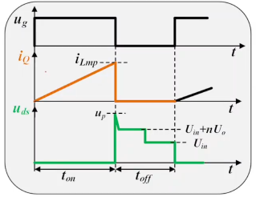
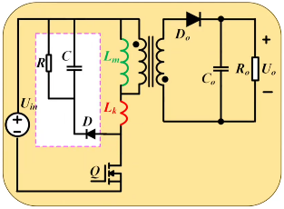

# 第七章 反激变换器 第四节：反激变压器漏感影响

[上一节](7.3-反激励磁电感计算.md)把励磁电感算完，反激的"理想部分"就结束了。但反激比三个基础拓扑多了一个变压器——也就多了一个绕不开的问题：**漏感**。本节讨论：**漏感从哪里来？它为什么会在开关管上产生足以击穿的电压尖峰？有哪些因素影响漏感？**

> **磁元件在开关电源中占"半壁江山"**——可以说电源就是围绕磁元件进行设计的。对磁元件理解不到位，电源就设计不好。本节只是从**电路角度**看漏感，磁学本质将在磁元件课程中展开。

---

## 一、漏感从哪里来

反激的变压器有**两个线圈**，一旦有两个线圈，就涉及**线圈之间的耦合**——而耦合**不可能达到 100%**。

用耦合电感描述（详见[7.2 节](7.2-反激等效变换.md)，反激的"变压器"更恰当的理解是耦合电感）：

- 耦合系数 $k$ 可以做到 **0.95 以上**，但**永远做不到 1**
- 只要 $k\neq1$，就有**没有耦合到副边的磁通**
- 这部分磁通只在原边自行闭合 → 它所对应的电感就是**漏感 $L_k$**（图中红色）

> **所以漏感是不可能做到零的。**

### 漏感的三个来源

| 来源 | 说明 |
|---|---|
| **变压器自身** | 原副边耦合不完全产生（上面所述） |
| **PCB 走线** | 变压器原边到管子、副边到输出的引线都必然有长度 → 有电感，且集中表现在原边 |
| **管子引脚** | 小功率反激常用插件封装（TO-220 等），引脚本身有电感 |

> **工程经验：** 不要小瞧插件引脚那一点电感。做项目时遇到过——**电流较大时引脚电感产生的尖峰极其严重，可达稳态电压的 2 倍以上**。

---

## 二、漏感的影响：致命的电压尖峰

（分析以 DCM 为例，波形看得更清楚；CCM 或 DCM **不影响结论**。）

### 2.1 Q 导通期间（$t_{on}$）

- 原边电流经 **$L_k$ 与 $L_m$ 串联**向上流动，所以**漏感电流与励磁电流大小完全相同**
- 此时副边没有电流（二极管反偏）→ 能量在变压器中存储

### 2.2 Q 关断瞬间——问题出现了

管子一关断，原边这条通路就没了。但两个电感的电流去向不同：

| 电感 | 电流去向 |
|---|---|
| **励磁电感 $L_m$** | **有通路**——通过理想变压器耦合到副边，经副边二极管释放出去 ✓ |
| **漏感 $L_k$** | **没有通路**——它不能耦合到副边 ✗ |

> **为什么漏感没有通路？** 漏感对应的磁通本来就**不与副边耦合**，所以它的能量无法通过变压器传到副边去。

而**电感电流不能突变**（把有电流的电感突然断开，两端会产生很高的电压）。漏感电流只能找一个出口——**给开关管的输出电容 $C_{oss}$ 充电**：

$$\frac{1}{2}L_k\,i_{Lmp}^2=\frac{1}{2}C_{oss}V_{pk}^2 \quad\Longrightarrow\quad V_{pk}=i_{Lmp}\sqrt{\frac{L_k}{C_{oss}}} \quad \text{(7.4-1)}$$

由于 $C_{oss}$ 很小，充上去的电压**极高** → 在 $u_{DS}$ 上产生一个**很高的电压尖峰**。

### 2.3 后果

| 后果 | 严重程度 | 说明 |
|---|---|---|
| **击穿开关管** | ★★★ 致命 | 尖峰超过管子耐压 → 管子损坏，电源彻底报废 |
| 效率下降 | ★ 次要 | 漏感能量无法传到副边 → 变成损耗 |

> **最恶劣的问题就是把开关管击穿**——效率低一点电源还能工作，管子击穿整机就废了。所以漏感的**首要问题是保护管子，而不是效率**。

### 2.4 漏感的影响因素

漏感受非常多因素影响：

- 磁芯的**形状**
- 绕组的**圈数**（$N_1$）与**变压器匝比**
- **绕线方式**（能否实现完全的三明治耦合）
- **绕线工艺**（绕得好不好——熟手绕得多，控制得更好）

**量级范围：**

$$L_k \approx 0.5\%\sim3\%\ \text{的}\ L_m$$

- 绕得好、经验足：可控制到 **1%**，甚至 **0.5%**
- 新手绕得不好：可能达到 **3%**

> 所以反激最"讨厌"的就是漏感问题——总希望它越小越好。

---

## 三、解决方案：RCD吸收（钳位）回路

针对漏感尖峰，最原始、也最常用的办法是在原边加一个 **RCD 回路**（三个无源元件）：

| 元件 | 作用 |
|---|---|
| **R**（电阻） | 泄放能量 |
| **C**（电容，也叫钳位电容） | 吸收漏感能量 |
| **D**（钳位二极管） | 单向导通，把漏感能量引入 C |

> **两种叫法：** 有的资料叫**吸收回路**（吸收漏感能量），有的叫**钳位回路**（把电压钳住）。其实**相辅相成**——正因为吸收了能量，才把电压钳住了；吸收不了能量，也就钳不住电压。

> **初学者难点：** 这个电路初次看会觉得"接反了、怎么可能工作"——它的工作过程确实有点特别，下一节专门讲。

---

## 四、本节小结

| 主题 | 核心结论 |
|---|---|
| 漏感来源 | 耦合系数 $k<1$（即使 >0.95）→ 有未耦合到副边的磁通 → 漏感 |
| 漏感的组成 | 变压器自身漏感 + PCB 走线电感 + 管子引脚电感 |
| Q 导通时 | 漏感与励磁电感**串联**，电流大小相同 |
| Q 关断时 | 励磁电流有通路（耦合到副边）；**漏感电流没有通路** |
| 尖峰机理 | 电感电流不能突变 → 漏感电流给 $C_{oss}$ 充电 → $V_{pk}=i_{Lmp}\sqrt{L_k/C_{oss}}$ |
| 主要危害 | **击穿开关管**（致命）；次要危害是损耗、影响效率 |
| 量级 | $L_k\approx0.5\%\sim3\%$ 的 $L_m$ |
| 解决办法 | **RCD 吸收/钳位回路**（3 个无源元件，简单、成本低） |

---

## 五、与后续内容的衔接

- [下一节](7.5-RCD钳位电路工作原理.md)详细拆解 RCD 的工作过程：为什么 Q 关断后电压被"钳"在 $U_{in}+U_{C\_max}$？钳位电容的电压为什么不能低于反射电压？
- [第六节](7.6-RCD参数计算.md)给出 R、C 的具体计算方法，并讨论有源钳位、准谐振等更高效的替代方案。
- 漏感的磁学本质（如何从绕制工艺上减小漏感）将在磁元件设计部分展开。
