# 第七章 反激变换器 第六节：RCD钳位电路工作原理

[上一节](7.5-反激变压器漏感影响.md)说明了漏感会在开关管上产生足以击穿的电压尖峰，解决办法是加 **RCD 回路**。本节拆解它的工作过程：**为什么 Q 关断后电压会被"钳"在 $U_{in}+u_{Cmax}$ ？钳位电容的电压为什么不能低于反射电压？**

> **初学者难点：** 这个电路第一眼看上去"接反了、不可能工作"。本节按时间顺序把它拆开——关键在于 **Q 关断瞬间有两个极短的时间段**，能量在这两段里走了不同的路径。

---

## 一、RCD的接法与极性

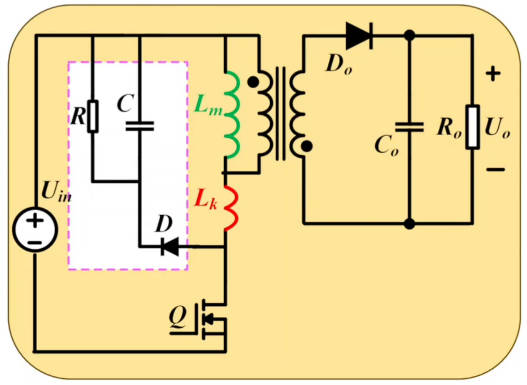

RCD 接在变压器**原边绕组的两端**（与励磁电感并联），由三个无源元件构成：

| 元件             | 作用               |
| -------------- | ---------------- |
| **D**（钳位二极管）   | 单向导通，把漏感能量引入 C   |
| **C**（钳位/吸收电容） | 吸收漏感能量           |
| **R**（电阻）      | 与 C 并联，泄放 C 上的能量 |

> **注意电容极性：** 输出电容是**上正下负**，而这个钳位电容是**下正上负**（图中 $u_C$ 的方向）——这正是它看起来"接反了"的原因。

> **它为什么不提高效率：** RCD 是**耗能型**回路——漏感能量最终被 R 消耗掉。它的作用不是提高效率，而是**保护开关管不被击穿**。

---

## 二、Q导通阶段（ $t_{on}$ ）：RCD不起作用

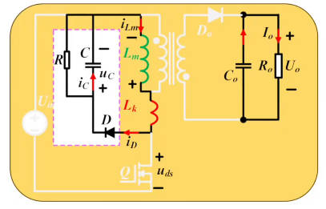

- Q 开通时，开关节点电位被拉到地
- 钳位二极管的**阳极接地、阴极接正电位** → **反偏截止**
- 于是钳位支路与主管断开，**RCD 完全不参与工作**
- 这段时间里，整流二极管（副边二极管）也反偏截止，能量全部储存在变压器中（与[7.1 节](7.1-反激CCM工作过程.md)一致）

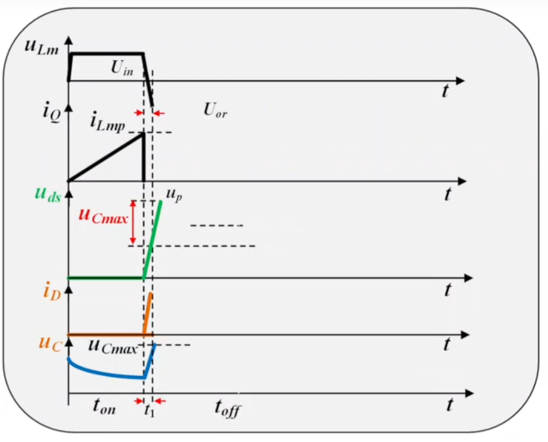

---

## 三、Q关断瞬间：两个极短的时间段

Q 关断后，励磁电感电压反向（下正上负），但**副边二极管不会立刻开通**——能量要走两条不同的路径，分两个时间段。

### 3.1 第一阶段：钳位二极管先导通

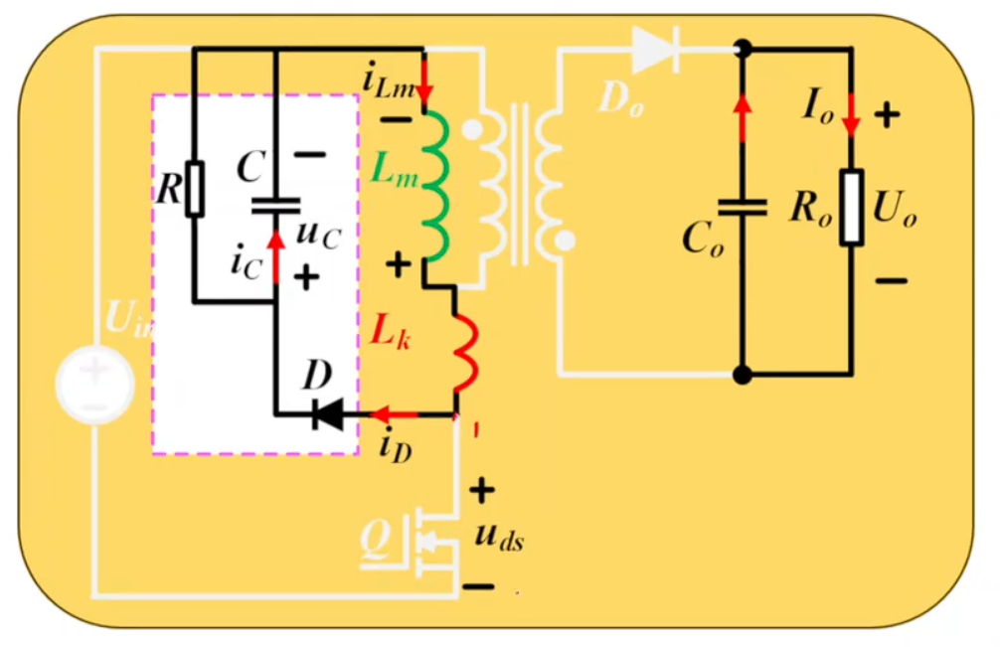

Q 一关断，原边电压开始上升。**只要原边电压超过钳位电容上的电压 $u_C$ ，钳位二极管就开通**（它的阳极电位高于阴极）：
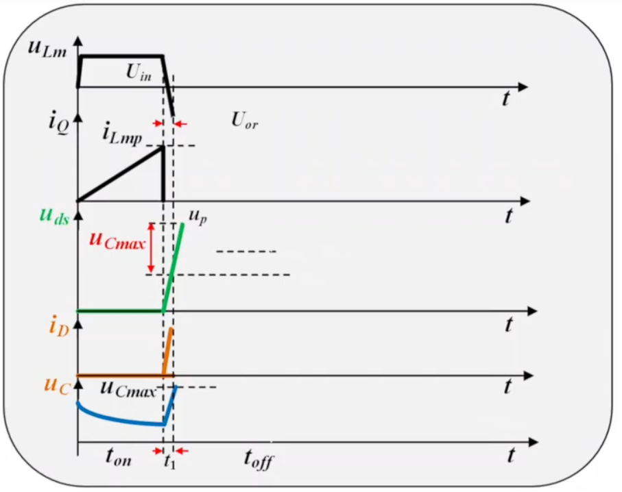
- **漏感的能量通过钳位二极管充入电容 C**
- 此时原边电压仍在继续上升（漏感能量较大）
- 副边二极管**尚未开通**

> 副边二极管为什么还没开？因为副边要正偏导通，必须让原边电压达到**反射电压 $n\cdot U_o$**（折算到原边）——在此之前，副边一直是被"顶住"的。

### 3.2 第二阶段：副边二极管开通，漏感继续放电

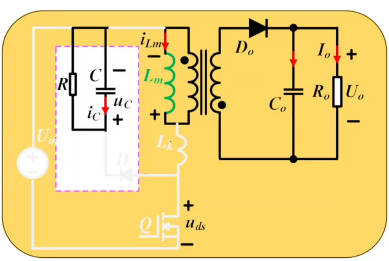

当原边电压升至 $n\cdot U_o$ 时，**副边二极管开通**，**励磁电感的主力能量**经由副边传输到负载端。

而**漏感能量这时仍在继续**通过钳位二极管给电容 C 充电（漏感与副边不耦合，走不了副边这条路）。

### 3.3 钳位效果

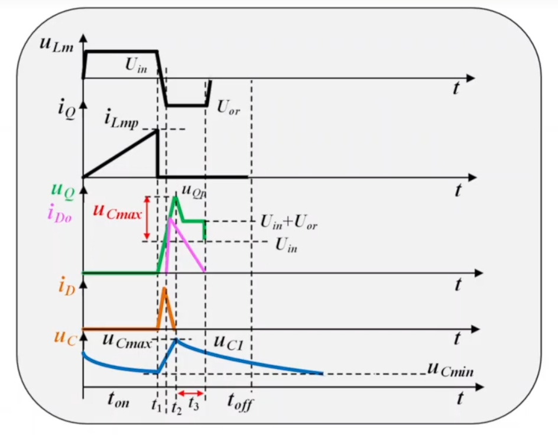

只要钳位二极管导通，开关管两端就被"顶"在一条回路上（D → C → $U_{in}$ ），由基尔霍夫电压定律：

$$\boxed{u_{DS}=U_{in}+u_{C\_max}} \quad \text{(7.6-1)}$$

**这就是"钳位"的含义**——Q 管的 $u_{DS}$ 被钳位在 $U_{in}+u_{C\_max}$ ，而不再像没有 RCD 时那样冲上极高的尖峰。

> **为什么叫"钳位"、又叫"吸收"？** 因为它把漏感能量**吸收**到了电容 C 里（电容像大水池一样能稳住电压），从而把电压**钳住**了。二者相辅相成：吸收不了能量，就钳不住电压。

### 3.4 漏感释放完毕

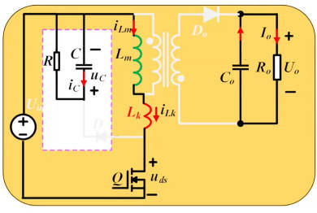

漏感能量全部转移进电容 C 后，漏感电流降到零 → **钳位二极管自然关断**。此时 $u_C$ 达到最大值 $u_{C\_max}$ 。

> 这两个时间段（Q关断 → 钳位二极管开通 → 副边二极管开通 → 漏感放完）都**极其短暂**，在整个开关周期中占比可以忽略——后面的计算通常直接把它们略去。

---

## 四、漏感释放完毕之后：电容经R放电

钳位二极管关断后，电容 C 通过并联的电阻 R 放电。这是一个典型的一阶 RC 放电过程，电压按**指数规律**下降（三要素法/一阶电路动态响应）。

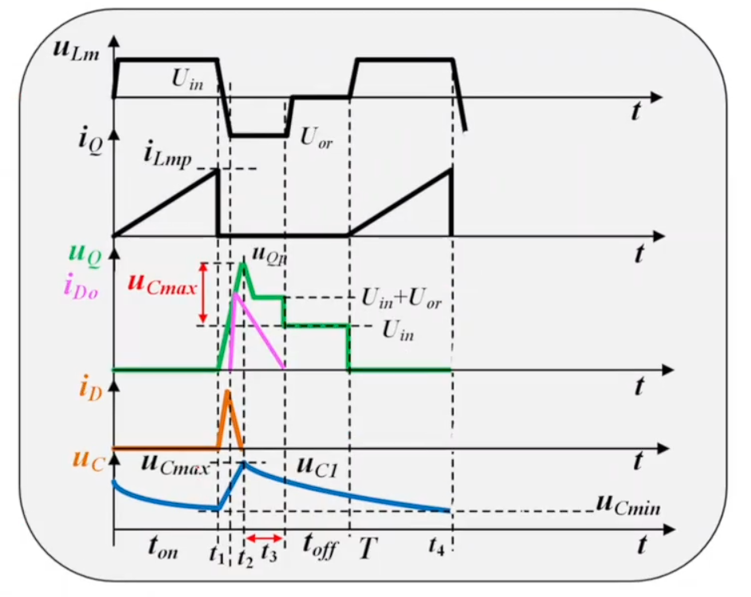

### 4.1 关键约束： $u_C$ 不能低于反射电压

在副边二极管导通期间（ $u_L$ 为 $n\cdot U_o$ ），**钳位电容的电压必须大于反射电压**：

$$\boxed{u_C > n\cdot U_o = U_{or}} \quad \text{(7.6-2)}$$

> **为什么？** 如果 $u_C$ 放得比 $n\cdot U_o$ 还低，那么钳位二极管的阳极电位就会高于阴极 → **钳位二极管会再次开通** → 本来应该送到副边的励磁能量被**泄放到钳位电路里消耗掉** → **严重拉低效率**。
>
> 所以：**C 放电不能放得太快**。

### 4.2 DCM 与 CCM 两种情形

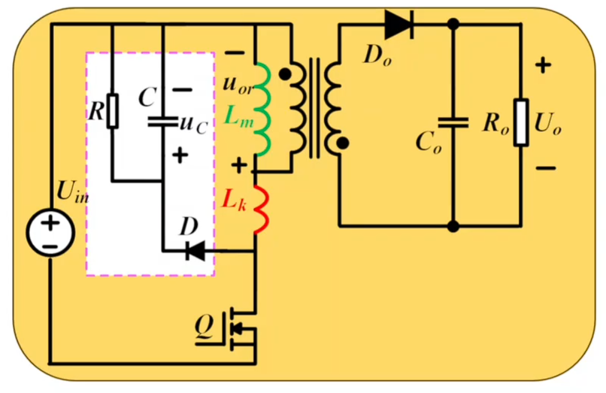

**DCM 模式**（副边二极管电流会在周期内降到零）：

- 副边电流降到零之后（图中 $t_3$ ），原边管子还没开通，进入**空档期**
- 但钳位电容**仍在通过 R 放电**——因为 R 一直并联在 C 上，只要钳位二极管不导通，C 就一直在放电
- 一直放到下一个周期 Q 关断

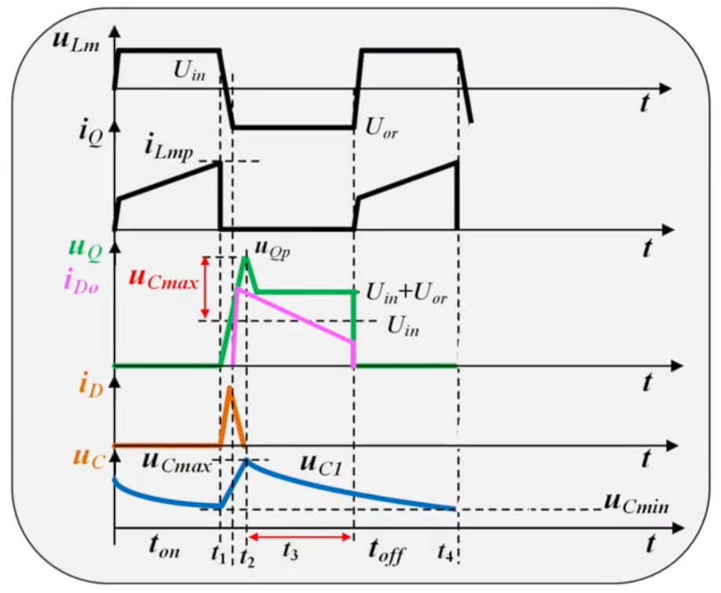

**CCM 模式**（副边二极管电流一直持续到下一次 Q 开通）：

- 整个 $t_{off}$ 期间变压器原边电压恒为 $n\cdot U_o$
- 因此整个 $t_{off}$ （即 $1-D$ 区间）内，**C 对 R 放电都不能放到小于 $n\cdot U_o$**

### 4.3 简化处理

由于"漏感给电容充电"的时间极其短暂，可以**保守地认为：在整个开关周期 $T$ 内，C 一直都在被 R 放电**——这会大幅简化后面[第七节](7.7-RCD参数计算.md)的计算。

---
## 五、设计约束与补充说明

### 5.1 电压上限约束

$$u_{DS\_max}=U_{in}+u_{C\_max}\le 0.8\times U_{DS(\text{额定})}$$

必须给管子留 **20% 余量**（保守可取 30%，即用 0.7 倍）。因为随着时间和温度变化，电容容量也会变化，实际电压可能进一步升高，超过 80% 就比较危险了。

### 5.2 补充：漏感对"原边电压 = $n\cdot U_o$"的影响

上面一直默认原边电压就是 $n\cdot U_o$——但这只在**理想全耦合变压器**下成立。

$$\frac{u_P}{u_S}\neq\frac{N_P}{N_S}\quad(\text{有漏感时})$$

漏感越大，实际原边电压越偏离 $n\cdot U_o$ 。不过一般漏感不大，工程上可以认为两者**约等于相等**。严格的磁学分析将在磁元件课程中展开。

---

## 六、本节小结

| 阶段 | 发生了什么 |
|---|---|
| **$t_{on}$ （Q 导通）** | 钳位二极管**反偏截止**，RCD 完全不起作用 |
| **$t_1$ （Q 关断）** | 原边电压开始上升；超过 $u_C$ 后**钳位二极管先开通**，漏感能量充入 C |
| **$t_2$ 之前** | 原边电压升到 $n\cdot U_o$ 时，**副边二极管开通**，励磁能量传向负载 |
| **钳位期间** | $u_{DS}=U_{in}+u_{C\_max}$ （KVL）——**这就是钳位** |
| **$t_2$ （漏感放完）** | 钳位二极管自然关断， $u_C$ 达最大值，随后 C 经 R **指数放电** |
| **约束一** | $U_{in}+u_{C\_max}\le0.8U_{DS(\text{额定})}$ （留 20% 余量） |
| **约束二** | 副边二极管导通期间 $u_C>n\cdot U_o$ ，否则钳位二极管再次开通、严重降效率 |

> **两句话记住：** ① RCD 把 $u_{DS}$ **钳位**在 $U_{in}+u_{C\_max}$ ；② RCD 是**耗能型**的，能量耗在 R 上，作用是**保管子**而非提效率。

---

## 七、与后续内容的衔接

- [下一节](7.7-RCD参数计算.md)：根据本节的两条约束，计算钳位电容 C 与电阻 R 的值。
- 更高效的替代方案（**有源钳位反激**、**准谐振反激**）也在下一节介绍。
- 漏感的磁学本质与绕制工艺改进，将在磁元件设计部分展开。
