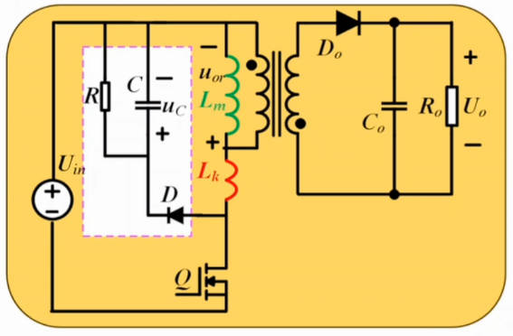
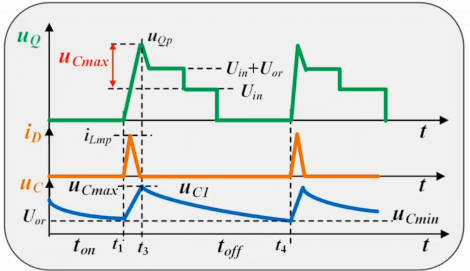
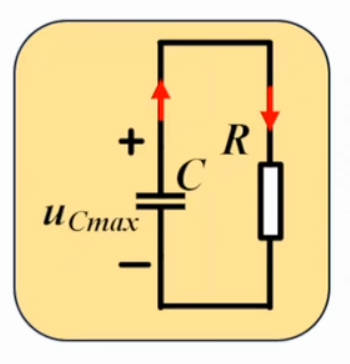

# 第七章 反激变换器 第七节：RCD参数计算

[上一节](7.6-RCD钳位电路工作原理.md)讲清了 RCD 的工作过程与两条约束。本节把 **C 和 R 的具体值算出来**：**钳位电容的电压上下限怎么定？C 和 R 分别由什么关系式决定？** 最后总结 RCD 的定位，并介绍两种更高效的替代方案。

---

## 一、器件选择

**钳位二极管 D：**

- 一般选用**高压快恢复二极管**
- 低压场合可以用肖特基，但**不建议**——肖特基的**漏电流较大**，而且**温度升高时漏电流会急剧增大**（可达 100 倍甚至几百倍以上）

> **本节的 RCD 是"无源钳位"**——三个都是无源器件。

---

## 二、钳位电容 C 的计算

### 2.1 先确定电压上限 $u_{C\_max}$

$u_{C\_max}$ 出现在**开关管关断、漏感能量全部释放进钳位电容之后**。此时开关管承受的电压也达到最大：

$$u_{Q\_pk}=U_{in}+u_{C\_max}$$

**约束：** 这个峰值电压必须小于管子耐压的一定比例——**至少留 20% 余量**（保守可取 30% 余量，即只用到 0.7 倍）：

$$\boxed{u_{C\_max}=0.8\,U_{DS(\text{额定})}-U_{in}} \quad \text{(7.7-1)}$$

> **为什么必须留余量？** 随着时间推移、温度变化，**电容容量本身也会漂移**，实际电压有可能进一步升高。若某一时刻冲到 90% 甚至更高，就非常危险了。
>
> **典型取值：** 传统离线式反激的管子耐压一般是 **600V 或 650V**，选完管子后按上式即可定出 $u_{C\_max}$ 的上限。

### 2.2 再确定电压下限 $u_{C\_min}$

由[上一节](7.6-RCD钳位电路工作原理.md)的简化：**漏感给电容充电的时间极短，可忽略**——于是可以认为**在整个开关周期 $T$ 内，电容 C 一直在放电**，从本次 Q 关断（达到 $u_{C\_max}$ ）一直放到下一次 Q 关断。

放电的终点（最低电压）必须满足：

$$\boxed{u_{C\_min}\ge U_{or}=n\cdot U_o\ (\text{反射电压})} \quad \text{(7.7-2)}$$

> **为什么不能低于反射电压？** 如果 $u_C<n\cdot U_o$ ，那么下一次 Q 关断时，**钳位二极管会先开通**——要先把钳位电容的电压抬到 $n\cdot U_o$ 之后，副边二极管才能开通。
>
> 这样一来，本该送到副边的（励磁）能量，就被**先充进钳位电容**、最终消耗在 R 上了 → **严重损耗效率**。
>
> 所以：**下限就是反射电压 $U_{or}=n\cdot U_o$**。
>
> （DCM 下这个约束可以适当放宽，但也不建议——原因同上。）

### 2.3 用能量守恒求 C

考虑**漏感的全部能量都进入钳位电容**，由能量守恒：

$$\frac{1}{2}L_k\,i_{Lmp}^2=\frac{1}{2}C\left(u_{C\_max}^2-u_{C\_min}^2\right)$$

$$\boxed{C=\frac{L_k\,i_{Lmp}^2}{u_{C\_max}^2-u_{C\_min}^2}} \quad \text{(7.7-3)}$$

**其中两个量的取值：**

| 量 | 取法 |
|---|---|
| $i_{Lmp}$ （励磁电流峰值） | 在**最低输入电压**下计算 |
| $L_k$ （漏感） | 用**数字电桥**测量（方法见磁元件课程） |

> **为什么在最低输入电压下算 $i_{Lmp}$ ？**
> - **CCM 下**：与 Buck-Boost 一样， $D$ 最大（最低输入电压）时励磁电流峰值最大
> - **DCM 下**：峰值不变（ $\frac{1}{2}L_mi^2$ 是常数），在哪儿算都一样
>
> 所以综合来看，**无论 CCM 还是 DCM 都在最低输入电压下计算**。

### 2.4 经验值

工程上做得多了，离线式小功率 ACDC 反激的钳位电容基本有个经验范围：

$$C \approx 1\text{nF}\sim10\text{nF}$$

> 可以直接按经验值先放一个，实际调试时再微调；有理论计算支撑则更好。

---

## 三、钳位电阻 R 的计算

认为整个周期内 C 都在对 R 放电（充电时间极短，忽略），且放电按**指数规律**：

$$u_{C\_min}=u_{C\_max}\cdot e^{-\frac{T}{RC}}$$

两边取对数解出 R：

$$\boxed{R=\frac{T}{C\cdot\ln\dfrac{u_{C\_max}}{u_{C\_min}}}=\frac{1}{f\cdot C\cdot\ln\dfrac{u_{C\_max}}{u_{C\_min}}}} \quad \text{(7.7-4)}$$

其中 $u_{C\_min}=U_{or}=n\cdot U_o$ （已知）， $T=1/f$ 。至此 **C 和 R 都算完了**。

---

## 四、实际需要微调

本节的理论分析**只考虑了变压器自身的漏感**，没有计入：

- **PCB 走线**带来的寄生电感
- **线路中的寄生电容**（只考虑了外焊的那个电容）

这些都会影响 R 和 C 的取值，而且**很难分析**——每个人的板子画法、结构、线长都不一样。

> **工程做法：** 算出值后先装上去（比如算出 30kΩ，就先放 30kΩ），再**实测效率微调**到合适的点——因为 RCD 会明显影响反激效率。

---

## 五、RCD的定位总结

| 项目 | 结论 |
|---|---|
| 类型 | **耗能型**钳位——能量消耗在 R 上 |
| 本质 | 把**本该损耗在开关管上的能量转移到了 R 上** |
| 能否提高效率 | **不能**——它不提高效率，只是**保护开关管不被击穿** |
| 典型效率 | 用 RCD 的反激效率一般 **85% 已算不错**，可能低于 80% |
| 优势 | 电路**极其简单**（只有 3 个无源元件）、成本低、**可靠性高** |
| 应用 | 小功率场合用量非常大；**大功率电源的辅助电源几乎都用 RCD 反激** |

---

## 六、更高效的替代方案

RCD 之外的方案，主要有两种思路：

### 6.1 有源钳位反激（Active Clamp）

- 用**有源器件**代替 RCD（所以 RCD 称为**无源钳位**）
- 仍有钳位作用，但**不是耗能型**——它把漏感能量**回馈到电源**，下次继续使用
- **能大幅提高效率**：提高 10 个百分点都很容易
- 还**可以实现 ZVS**（软开关）

### 6.2 准谐振反激（QR Flyback）

- 提高效率的思路**类似软开关**（可以说是"准 ZVS"）
- 与有源钳位是两种不同的提效思路

### 6.3 两者对比与应用

| 方案 | 提效原理 | 效率水平 |
|---|---|---|
| RCD（无源钳位） | 不提高效率，只保护管子 | ~85% 以下 |
| 有源钳位 | 能量回馈电源 + ZVS | 可轻松 90%+ |
| 准谐振 | 软开关（准 ZVS） | 可轻松 90%+ |

> 这两种拓扑目前在**手机充电器、小功率电脑/Pad 充电器**中用量非常非常大——因为效率可以做得很高。后续会专门讲有源钳位技术。

---

## 七、本节小结

| 主题 | 核心结论 |
|---|---|
| 钳位二极管 | 高压快恢复；不建议肖特基（漏电流随温度剧增） |
| 电压上限 | $u_{C\_max}=0.8U_{DS(\text{额定})}-U_{in}$ （至少留 20% 余量） |
| 电压下限 | $u_{C\_min}=U_{or}=nU_o$ （低于它会让钳位二极管再次开通、降效率） |
| 电容 C | $C=\dfrac{L_k i_{Lmp}^2}{u_{C\_max}^2-u_{C\_min}^2}$ ，经验值 1~10nF |
| 峰值电流取值 | 在**最低输入电压**下计算（CCM/DCM 通用） |
| 电阻 R | $R=\dfrac{1}{fC\ln(u_{C\_max}/u_{C\_min})}$ ，按指数放电 |
| 实际做法 | 理论值先装上，再实测效率微调（未计 PCB 走线与寄生电容） |
| RCD 定位 | 耗能型、不提高效率、只保护管子；简单、便宜、可靠 |
| 替代方案 | **有源钳位**（能量回馈+ZVS）、**准谐振**（准 ZVS），效率可达 90%+ |

---

## 八、与后续内容的衔接

- 至此，反激的**主电路设计链条**完成：[工作过程](7.1-反激CCM工作过程.md) → [等效变换与BCM](7.2-等效变换与BCM工作过程.md) → [DCM过程与增益](7.3-反激DCM工作过程与增益.md) → [励磁电感](7.4-反激励磁电感计算.md) → [漏感](7.5-反激变压器漏感影响.md) → [RCD原理](7.6-RCD钳位电路工作原理.md) → 本节参数计算。
- [下一节](7.8-稳态电流应力与电容选型.md)：各元件电流应力与电容选型，为器件选型提供完整依据。
- 漏感的测量方法、磁学本质与绕制工艺，将在**第六章 变压器及磁元件设计**中展开。
- 后续方向：有源钳位反激、准谐振反激；环路补偿设计。
