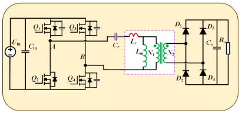
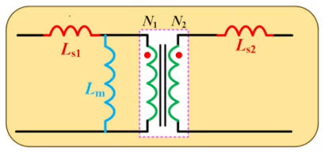
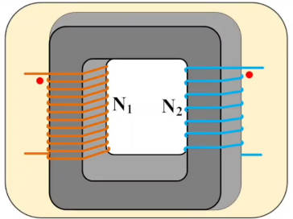
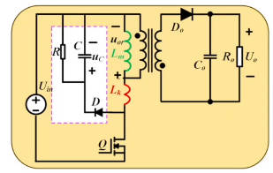

# 第七章 反激变换器 第七节：反激漏感与LLC漏感一样吗

> **本节是插播内容**——不少朋友在后台问：**反激的漏感怎么测量？LLC 的漏感跟反激的漏感是一回事吗？** 本节从**电路角度**（不讲磁学本质）把这个问题说清楚。

[第四](7.4-反激变压器漏感影响.md)～[六节](7.6-RCD参数计算.md)一直在跟漏感打交道，但都是从"反激的工作需要"出发。本节换一个角度：**当你拿起电桥去测一个变压器时，测出来的那个"漏感"到底是谁的漏感？**

---

## 一、问题的由来：磁集成

这是 **LLC 变换器**的拓扑（全桥 LLC + 全桥整流）。其中 $L_r$ 是**谐振电感**、 $C_r$ 是谐振电容、 $L_m$ 是励磁电感。

实际设计中常常把 **$L_r$ 集成到变压器里**——用**变压器的漏感**来充当谐振电感，这种做法称为**磁集成**。

> **为什么要磁集成？** 省掉了独立的谐振电感 → **成本降低**、**体积下降**。尤其在大功率场合，谐振电感所占的体积和成本是相当可观的。

于是就产生了一个疑问：**LLC 的变压器有漏感，反激的变压器也有漏感——这两个漏感是一回事吗？电桥测出来的又是哪个？**

---

## 二、变压器的等效模型

先建立一个考虑漏感的变压器模型（图中粉色框是"理想变压器"部分）：

| 符号 | 含义 |
|---|---|
| $L_{s1}$ | **原边漏感**（串在原边） |
| $L_m$ | **励磁电感**（并联在原边） |
| $N_1 / N_2$ | 原副边绕组（含匝比） |
| $L_{s2}$ | **副边漏感**（串在副边） |

> 反激也好、LLC 也好，都有励磁电感 $L_m$ 。

物理上它就是**同一个磁芯上绕着的两个线圈**（ $N_1$ 、 $N_2$ ）——理解后面的"漏感属于哪个绕组"，先要建立这张物理图景。

---

## 三、电桥的两步测量法

### 3.1 电桥是怎么工作的

电桥在**两个端口之间加一个很小的电压**（可能只有 0.1V、0.3V 等；好的电桥这个电压可调），然后测这个端口的 $U$ 与 $I$ 。

- $U$ 与 $I$ 之间**有相位差**，但要测的其实就是二者的比值
- 这个比值就是**感抗**，再结合**电桥上设定的频率**（1kHz、10kHz、20kHz、100kHz，好的电桥可达上兆赫兹）就能算出**电感**值
- **原理与频率无关**（频率只是用来算电感的一个已知量）

### 3.2 第一步：副边开路

- 把**副边开路**（什么都不接），电桥接在原边读一个值
- 工程上一般**把这个值当作励磁电感**——**但严格说它不是**（见第五节）

### 3.3 第二步：副边短路

- 把**副边两个线圈短接**，电桥在原边再读一个值
- 这个值**比第一步小很多**，工程上一般把它称为"**变压器的漏感**"

> 问题就出在这里：**这个测出来的漏感，是不是反激的漏感？**

---

## 四、关键结论：测出来的是"LLC的漏感"

$$\boxed{\text{副边短路测出的漏感} \begin{cases} \textbf{不是}\ \text{反激的漏感}\\ \textbf{就是}\ \text{LLC 的漏感} \end{cases}}$$

### 4.1 为什么？——两种电路工作方式有本质区别

| | 原边工作时，副边的状态 |
|---|---|
| **反激** | 副边**开路**——副边二极管反偏截止，副边有电压但**没有电流**流出，整个电压由二极管承担 |
| **LLC** | 副边**不是开路**——副边二极管导通，副边接在输出电容 $C_o$ 上（电压 $U_o$ ），**副边有电流** |

> **副边没有电流 ＝ 相当于没有这个线圈 ＝ 开路。** 这就是反激的本质特征。

### 4.2 电桥第二步测量 = 在模拟 LLC 的工作方式

副边短路后，电桥在原边加小电压 → **副边会感应出电压，从而也有感应电流**——这与 LLC 工作时"副边被加了电压、有电流"的情形**完全一样**，只是电桥的电压比 LLC 实际工作电压低得多。

> 所以：**电桥（副边短路）看到的等效电路，就是 LLC 谐振电容看进去的那个等效电路。**

### 4.3 具体量出来的是什么

副边短路时，副边漏感 $L_{s2}$ 折算到原边成为 $L_{s2}'$ （折算即乘以 $n^2$ ），它与 $L_m$ **并联**，再与 $L_{s1}$ 串联：

$$L_{measured}=L_{s1}+\left(L_{s2}'\parallel L_m\right) \quad \text{(7.7-1)}$$

由于**励磁电感远大于漏感**（ $L_m\gg L_{s2}'$ ），并联之后 $L_m$ 几乎不起作用，可以近似为两者相加：

$$L_{measured}\approx L_{s1}+L_{s2}' \quad\text{（原边漏感 + 副边漏感折算值）} \quad \text{(7.7-2)}$$

> **即：电桥测出来的，是"从谐振电容看进去的等效电感"——也就是 LLC 所看到的那个电感。**

---

## 五、那反激的漏感到底是什么？

反激工作时，副边是**开路**的（相当于没有这个线圈）→ **只有原边自己**。

$$\boxed{\text{反激的漏感} = \text{原边自身的漏感}\ L_{s1}}$$

它**不包含**副边漏感折算过来的那一部分，所以：

> **电桥（第二步）测量不出来反激的漏感**——测出来的是含副边漏感的那个值，它**大于**反激真实的漏感。

### 5.1 顺便说明：副边开路测的也不是励磁电感

- 副边开路时电桥测到的是这个线圈的**自感**
- 而**励磁电感**指的是**与副边相耦合的那一部分电感**
- 线圈产生的磁通里，有一部分**没有耦合到副边**——这部分形成的电感才是漏感

### 5.2 本质理解

$$\boxed{\text{励磁电感、漏感、自感——其实都是同一个线圈在不同状态下的"对外等效表现"}}$$

- 副边**开路**测 → 自感（对外表现之一）
- 副边**短路**测 → 含副边漏感折算值的等效电感（对外表现之二）
- 线圈还是那个线圈，只是**外部条件不同，对外呈现的等效值不同**

> 这一点理解起来偏深入，属于磁学的范畴，磁元件课程会详细展开。

---

## 六、本节小结

| 主题 | 核心结论 |
|---|---|
| 磁集成 | LLC 用变压器漏感充当谐振电感 → 省掉独立谐振电感，降成本、减体积 |
| 测量第一步 | 副边**开路**测 → 工程上当作"励磁电感"，严格说它是**原边自感** |
| 测量第二步 | 副边**短路**测 → 工程上称为"变压器漏感" |
| 关键结论 | 第二步测出的是 **LLC 的漏感**，**不是反激的漏感** |
| 根本原因 | **反激工作时副边是开路的**；LLC 工作时副边有电压、有电流 |
| 第二步测到的值 | $L_{s1}+(L_{s2}'\parallel L_m)\approx L_{s1}+L_{s2}'$ （含副边漏感折算） |
| 反激的漏感 | **就是原边自身的漏感 $L_{s1}$**，电桥测不出来 |
| 本质 | 自感/励磁电感/漏感都是**同一线圈在不同状态下的对外等效表现** |

> **一句话记住：** 反激副边开路 → 只"看见"原边自己的漏感；LLC 副边有电流 → 原副边漏感一起算。

---

## 七、与后续内容的衔接

- 本节是**插播**，回到主线：反激的**主电路设计链条已在[上一节](7.6-RCD参数计算.md)完成**（工作过程 → 等效变换 → 励磁电感 → 漏感 → RCD）。
- **漏感的具体测量方法**（电桥怎么接、怎么读数、如何得到反激真正的 $L_{s1}$ ）将在磁元件课程中详细展开。
- 更深入的磁学内容（磁通、耦合系数、绕制工艺如何影响漏感）同样在磁元件课程中讲解。
- **LLC 变换器**本身将在谐振变换器章节系统学习，届时会回到本节提到的"用漏感做谐振电感"这一设计手法。
